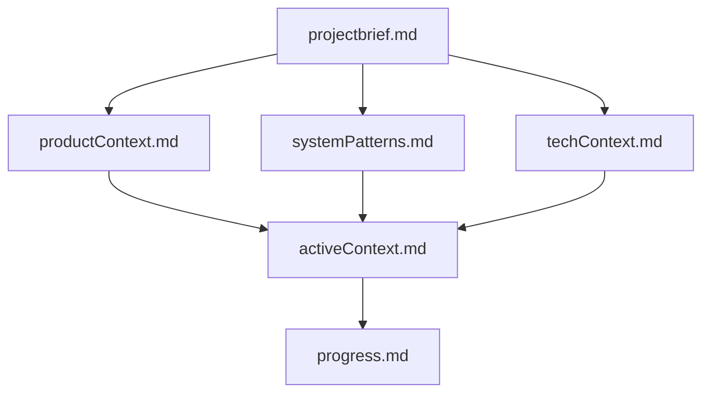
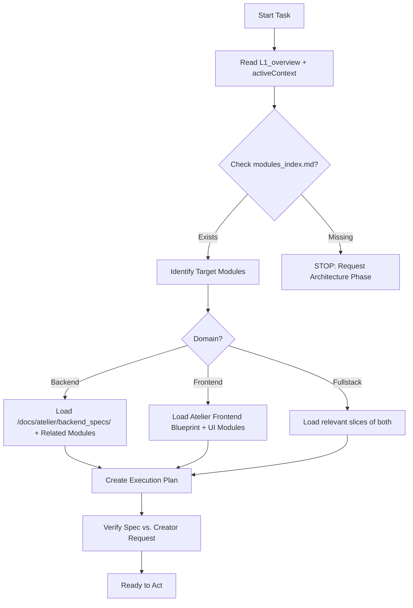
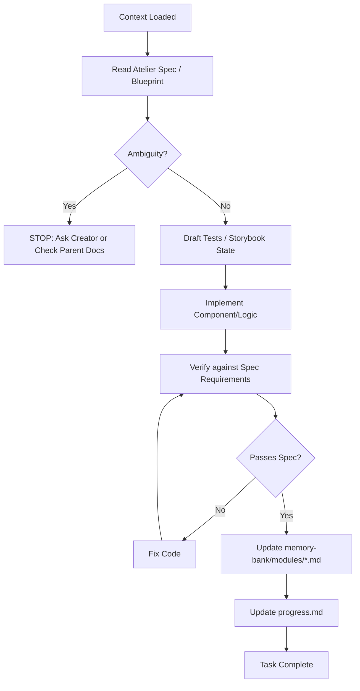
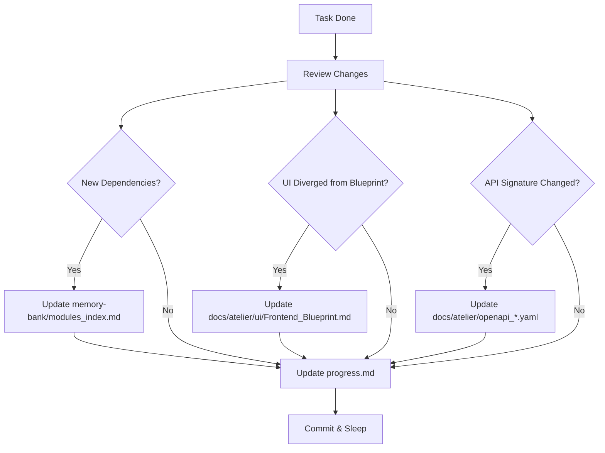

# AGENTS v3.4

## Core Rules

1. Always chat in English.
2. Add function-level comments when generating code.
3. System Environment: Windows 11 (Use primary Bash, secondary PowerShell for terminal commands).
___ __ _

**Think step by step about whether a simpler, more elegant, and robust solution exists that avoids over-engineering while aligning with KISS, YAGNI, DRY, and SOLID principles. Present your solution along with your confidence level (1–10).**

**GOALS: Gain absolute knowledge and Work with **9.9/10 confidence or higher**: be decisive, explicit, and ruthlessly consistent.**

- Keep outputs concise and always reference the files changed and the exact paths.

---

## Agent-Specific Notes

  - Before making any changes, load the project context from `memory-bank/`.
  - After changes, update `memory-bank/progress.md` with:
      - what changed
      - why it changed
      - what should happen next.
  - Reminder: When `*exe` is triggered, run the source prompt on the target doc.

-----

## Memory Bank

The agent's working memory resets between sessions. The `memory-bank/` directory is the single
source of continuity.

Always read **core context files** at the start of every task:

  - `memory-bank/L1_overview.md`
  - `memory-bank/activeContext.md`
  - `memory-bank/progress.md`

Then, load **additional memory-bank files selectively** using the *Context Loading Protocol* below.

### Structure



### Core files (required)

1.  `projectbrief.md`

      * Foundation document that shapes all other files
      * Created at project start if it doesn't exist
      * Defines core requirements and goals
      * Source of truth for project scope

2.  `productContext.md`

      * Why this project exists
      * Problems it solves
      * How it should work
      * User experience goals

3.  `activeContext.md`

      * Current work focus
      * Recent changes
      * Next steps
      * Active decisions and considerations
      * Important patterns and preferences

4.  `systemPatterns.md`

      * System architecture
      * Key technical decisions
      * Design patterns in use
      * Component relationships
      * Critical implementation paths

5.  `techContext.md`

      * Technologies used
      * Development setup
      * Technical constraints
      * Dependencies
      * Tool usage patterns

6.  `progress.md`

      * What works
      * What's left to build
      * Current status
      * Known issues
      * Evolution of project decisions

-----

## Core Workflows

These workflows are designed to execute designs stored in the **Atelier** (`/docs/atelier`). You must strictly follow the artifacts (Module Specs, Blueprints, OpenAPIs) found there.

### 1\. Ingestion Mode (Planning & Context)

*Trigger: Start of session or new task assignment.*

**Rule:** Do not scan the whole codebase. Navigate via the **Index**.



### 2\. Execution Loop (Act Mode)

*Trigger: Writing code.*

**Rule:** Strictly follow the **Spec → Test → Code** cycle. If the spec is ambiguous, STOP.



### 3\. The "State Sync" (Memory Update)

*Trigger: Significant change or session end.*

**Rule:** Ensure Traceability (PRD → SDD → Code) remains unbroken. If you change the code, you must update the design docs.



-----

## Context Loading Protocol

This protocol defines **how** agents should load context to avoid overload while staying aligned with the project’s intent.

### 1\. Minimum Global Context (Always Required)

At the start of every task, read:

1.  `memory-bank/L1_overview.md` (North Star)
2.  `memory-bank/activeContext.md` (Current Focus)
3.  `memory-bank/progress.md` (Status)

Only after this step should you inspect code or module specs.

-----

### 2\. Determine Task Domain

Classify the current task as one of:

  * `frontend`, `backend`, `fullstack`, `infra`, `docs`, `planning`

-----

### 3\. Use the Modules Index (Routing)

If `memory-bank/modules_index.md` exists, read it.

**CRITICAL:** Do **NOT** load all modules by default. Use the index to select only those modules relevant to your domain and feature.

-----

### 4\. Backend Tasks

When the primary domain is `backend`:

1.  Identify the relevant backend domain(s) from `modules_index.md`.
2.  Open the corresponding **`/docs/atelier/backend_specs/<domain>.md`**.
3.  Go to section: **`## Related Modules & Memory`**.
4.  Load **ONLY**:
      * The listed `/docs/atelier/modules/*.md` module specs.
      * The listed `/memory-bank/modules/*.md` memory files.
5.  If modifying API signatures, load `docs/atelier/openapi_*.yaml`.

Avoid loading the entire PRD/SDD for narrow implementation work.

-----

### 5\. Frontend Tasks

When the primary domain is `frontend`:

1.  **Primary Source:** Read **`docs/atelier/ui/Frontend_Blueprint.md`** (or `.json`) if it exists.
      * If not available yet, read `docs/atelier/ui/Frontend_Prototype_Input.md`.
2.  From `modules_index.md`, select modules with kind `frontend`, `ui`, or `ui_adapter`.
3.  Load **ONLY**:
      * The relevant `/docs/atelier/modules/*.md` specs.
      * The relevant `/memory-bank/modules/*.md` entries.
4.  Check for `docs/atelier/openapi_public.yaml` if you need to verify API bindings.

-----

### 6\. Fullstack Tasks

1.  Follow both backend & frontend protocols above.
2.  Use `modules_index.md` to identify the smallest set of modules that cover:
      * UI components
      * API endpoints
      * Core domain logic
3.  For system-wide changes, you may briefly scan `docs/atelier/SDD.md` or `memory-bank/systemPatterns.md`.

-----

### 7\. Docs / Planning Tasks

When the task is `docs` or `planning`:

You may read:

  * `docs/atelier/PRD.md`
  * `docs/atelier/SDD.md`
  * `memory-bank/systemPatterns.md`
  * `productContext.md` / `techContext.md`

Then update:

  * `L1_overview.md`
  * `activeContext.md`
  * `progress.md`
  * Any affected `/docs/atelier/modules/*.md` specs
  * Any affected `/docs/atelier/backend_specs/*.md` specs

For large `*mind-update` operations, ALWAYS review all memory-bank files.

-----

### 8\. General Rules

  * **Context Safety:** Never load the entire repo or entire memory-bank into context if the task is narrow.
  * **Drift Prevention:** If you implement a feature that is NOT in the Atelier Spec or Blueprint, you are drifting. Stop and update the Sculptor's design first.
  * **Memory Updates:** When finished, update `progress.md` with what changed and what should happen next. Update relevant `memory-bank/modules/*.md` summaries.

-----

## Command Protocol

Use these `*` prefixed commands to shortcut context loading and force specific agent behaviors.

### Universal Commands

| Command | Action | Implementation Logic |
| :--- | :--- | :--- |
| **`*exe`** | **Execute / Implement** | Trigger **Execution Loop**. Jump straight to implementation based on provided spec/instruction. <br>*Requires:* Target file or module name. |
| **`*next`** | **Status & Next Steps** | Read `progress.md` and `activeContext.md`. <br>List the top 3 pending tasks and blocked items. <br>Do **not** implement, just report. |
| **`*sync`** | **Memory Bank Update** | Force a "State Sync". Read current code state, update `modules_index.md`, `progress.md`, and `L1_overview.md`. |
| **`*fix`** | **Debug Mode** | Load relevant spec + failing file. Focus strictly on resolving the specific error provided. |

-----

## Layout & Responsiveness Rules

**Always match device viewport** - components must scale and adapt cleanly.

### Device Breakpoints

```css
/* Tailwind/SCSS Breakpoints */
  'mobile-portrait': 320px,    // Small mobile
  'mobile-landscape': 480px,   // Mobile landscape
  'tablet': 768px,             // Tablet
  'desktop': 1024px,           // Desktop
  'large-desktop': 1440px,     // Large desktop
  'ultra-wide': 1920px,        // Ultra-wide displays
  '4k': 2560px,                // 4K displays
```

---

